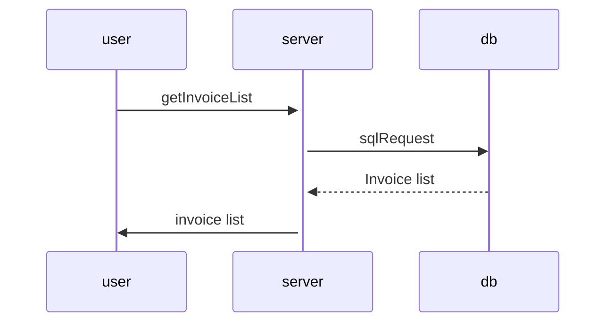
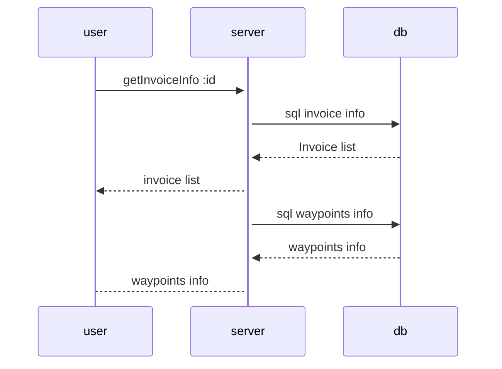
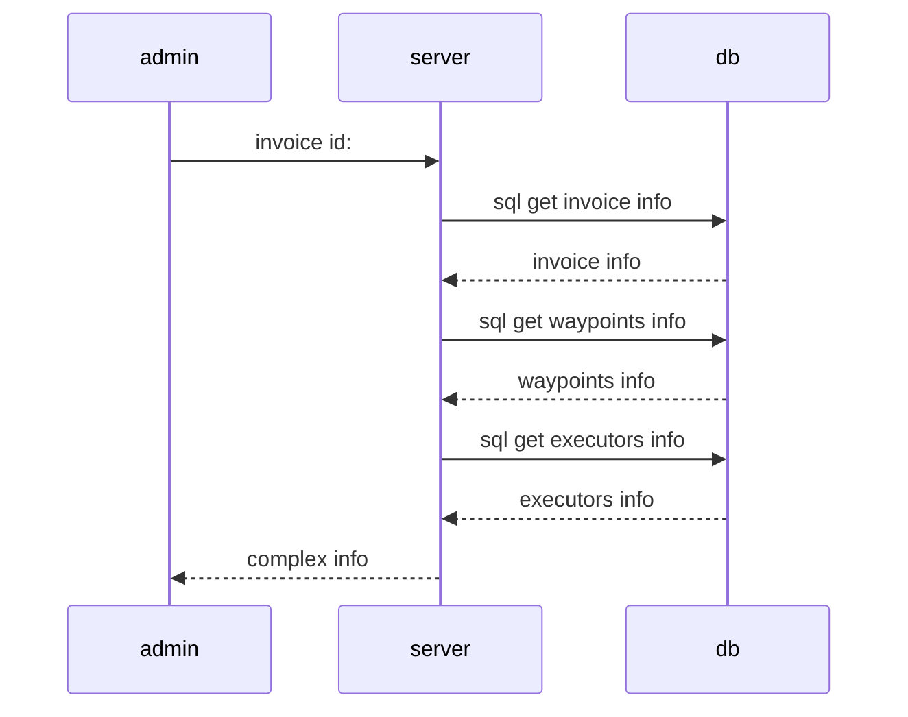

[animate.css](https://animate.style)

## Пользователь

- Просматривать свои заказы
- Получить информацию о состоянии заказа

## Администратор

- Получить информацию по любому заказу
- Создать новый заказ

## Исполнитель

- Получить список заказов в пункте
- Отметить принятие заказа к перевозке на участке
- Отметить завершение заказа к перевозке на участке

### User get invoice info

### Admin invoice info

